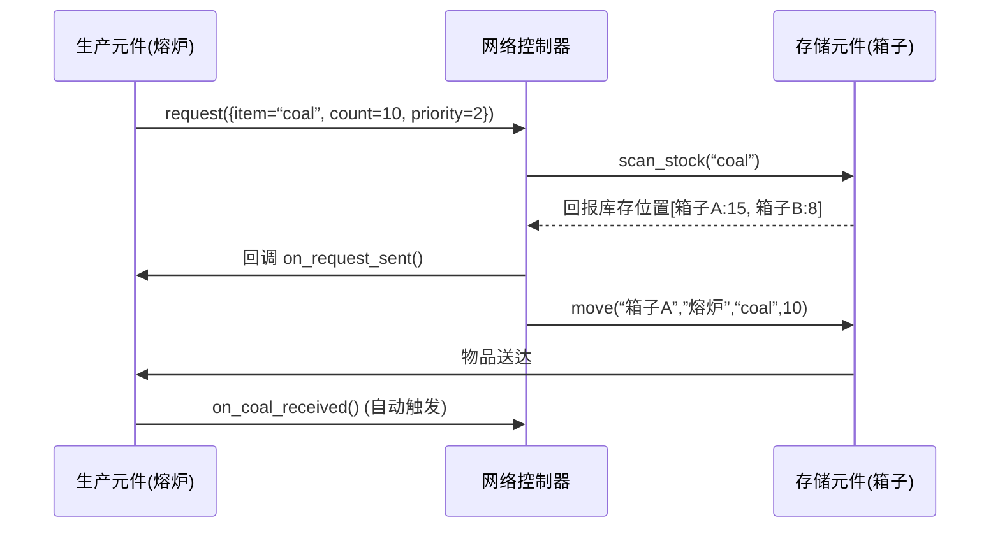
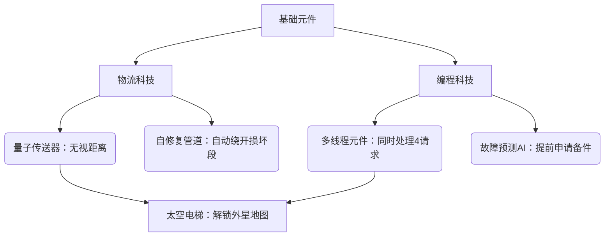

**——3D空间编程沙盒游戏设计文档 v1.0**  
*最后更新：2026年1月20日*  
*设计原则：代码即积木，空间即策略*

---

## 一、游戏概述
### 1.1 核心概念
- **类型**：3D空间策略编程沙盒（单机/创意工坊联机）
- **平台**：PC/主机（键鼠+手柄双操作优化）
- **目标用户**：  
  - 编程爱好者（喜欢人力资源机器/深圳I/O）  
  - 自动化迷（Factorio/异星工厂玩家）  
  - 模组创作者（Minecraft AE2深度用户）
- **核心循环**：  
  `规划空间 → 摆放元件 → 编写逻辑 → 优化网络 → 达成目标 → 解锁新可能`

### 1.2 差异化设计
| 传统工厂游戏       | 本作创新点                  |
|--------------------|---------------------------|
| 预设流水线         | **元件自主决策**（每个元件运行独立代码） |
| 平面网格布局       | **3D空间策略**（高度/遮挡/距离影响物流） |
| 固定配方           | **动态供需**（请求系统驱动全网流动）    |
| 无代码或简单开关   | **真实代码沙盒**（带安全防护的Lua子集） |

---

## 二、核心系统设计
### 2.1 3D空间规则（物理层）
#### 空间属性
| 属性        | 规则说明                                                                 | 玩家策略意义               |
|-------------|------------------------------------------------------------------------|--------------------------|
| **距离**    | 物品移动速度 = 5格/秒 - (距离×0.1)                                      | 高频元件需紧密布局         |
| **遮挡**    | 无线网络（AE2风格）穿墙衰减：混凝土墙-40%信号，玻璃-5%                    | 需规划信号中继塔           |
| **高度**    | 重力影响：储物箱在高处 → 低处运输节省30%能源；熔岩区元件需冷却模块         | 垂直空间利用               |
| **地形**    | 沙漠区散热慢（需额外散热代码）、雪原区能源效率+15%                        | 代码需适配环境             |

#### 交互设计
- **元件摆放**：  
  - 按`F`吸附到网格（1m³基础单位）  
  - 按`Tab`切换连接模式：**物理管道**（无延迟/占空间） vs **无线网络**（有延迟/穿透墙体）
- **空间诊断**：  
  - 按`Alt+L`显示热力图：**红**=请求阻塞 **黄**=能源不足 **绿**=高效运行  
  - 鼠标悬停元件显示实时数据流（如：`[熔炉3] 煤炭请求: 2次/秒`）

### 2.2 物流请求系统（核心机制）
#### 请求生命周期


#### 关键API（安全沙盒版Lua）
```lua
-- 全局函数 (所有元件可用)
function request(config)  -- 防洪设计
  if config.count > get_max_request() then 
    log("警告: 请求超限！" + config.count + " > " + get_max_request())
    return false 
  end
  return _system_request(config) -- 内置安全层
end

function get_stock(item) -- 返回当前元件库存
  return _system_get_stock(item) 
end

-- 网络控制器专属
function find_storage(item, min_count) 
  // 返回 {id="chest_01", stock=25, distance=12.3} 
  // 按距离+库存量排序
end

function execute_transport(sources, dst, item, count, delay=0)
  // 自动拆分请求: 若sources[0].stock=15 < 20, 则取15+5
  // delay参数用于模拟物理延迟
end
```

#### 防死锁机制
- **超时熔断**：单请求超过60秒未响应 → 自动取消并广播`on_request_timeout()`  
- **循环检测**：系统扫描请求链（A→B→C→A）→ 强制暂停并高亮环路  
- **沙盒保护**：所有代码运行在隔离线程，崩溃时回滚到上一安全帧（无数据丢失）

### 2.3 元件编程系统
#### 元件生命周期
| 阶段         | 触发条件               | 典型用途                          |
|--------------|----------------------|---------------------------------|
| `init()`     | 元件首次通电           | 设置ID/注册网络/初始化状态变量     |
| `on_tick()`  | 每1秒调用1次          | 检查库存/发起请求/状态监控         |
| `on_event()` | 外部事件触发（如收货） | 处理回调/启动新流程               |
| `on_destroy()`| 元件被拆除            | 释放网络资源/保存进度             |

#### 代码编辑器设计
  
*(注：实际开发时提供视觉稿)*
- **三窗格布局**：  
  1. **3D视图**（左）：高亮选中元件  
  2. **代码区**（中）：语法高亮+智能补全（输入`req`提示`request()`）  
  3. **调试台**（右）：实时日志 + 断点控制（可暂停单个元件）
- **安全特性**：  
  - 禁用危险函数（`os.execute`/文件操作）  
  - 循环保护：`for`循环超1000次自动中断  
  - 资源监控：CPU占用>80%时降频运行

#### 新手友好设计
- **逻辑块模式**（默认开启）：  
  ```plaintext
  [当] 库存(coal) < 5 
  [执行] 请求(coal, 20, 优先级=2)
  [回调] 日志("煤炭已补充")
  ```
  → 后台生成等效代码，可随时切换至代码视图
- **智能修复**：  
  ```diff
  - request "coal" 10   // 红色波浪线
  + request({item="coal", count=10}) // 悬停显示修复建议
  ```

---

## 三、内容规划
### 3.1 元件库（V1.0基础版）
| 类型       | 元件          | 核心功能                     | 编程复杂度 |
|------------|--------------|----------------------------|----------|
| **生产**   | 基础熔炉      | 1铁矿+1煤→1铁锭 (需热管理)    | ★☆☆      |
|            | 量子组装机    | 多输入合成（需写合成逻辑）     | ★★★      |
| **存储**   | 智能储物箱    | 响应网络请求/自动分类          | ★★☆      |
|            | 低温缓存器    | 保存易燃品（需温度监控代码）    | ★★★      |
| **控制**   | 网络控制器    | 路由请求/吞吐量管理            | ★★☆      |
|            | 逻辑门阵列    | 执行AND/OR/NOT条件判断         | ★☆☆      |
| **工具**   | 信号中继塔    | 增强无线网络范围               | ☆☆☆      |
|            | 能源分配器    | 动态调节元件供电优先级         | ★★☆      |

### 3.2 目标系统
#### 任务模板（动态生成）
```json
{
  "id": "med_supply_01",
  "name": "急救药品订单",
  "description": "医疗站急需50单位抗生素，30分钟内送达",
  "reward": {
    "credits": 1500,
    "unlock": "生物实验室科技"
  },
  "failure_condition": {
    "timeout": 1800, // 秒
    "penalty": "医院满意度-20%"
  },
  "debug_hint": [ // 失败时逐步提示
    "检查抗生素合成线是否通电",
    "网络控制器吞吐量是否≥30件/秒？",
    "医疗站请求优先级应设为1"
  ]
}
```

#### 科技树分支


### 3.3 地图类型
| 地图          | 空间挑战                  | 特殊规则                     |
|---------------|-------------------------|----------------------------|
| **标准基地**  | 平坦地形+基础资源         | 无                          |
| **峡谷要塞**  | 陡坡/岩架分割区域         | 仅允许垂直管道运输           |
| **数据核心**  | 虚拟空间（代码即地形）     | 元件性能=编写代码质量        |
| **外星巢穴**  | 动态地形（生物破坏管道）   | 需防御代码：`on_attack()`   |

---

## 四、技术实现规范
### 4.1 代码运行架构
```plaintext
                          +---------------------+
                          |   主游戏引擎 (C#)   |
                          +----------+----------+
                                     |
                          +----------v----------+
                          | 沙盒VM (Lua 5.4)    |
                          |  - 资源隔离         |
                          |  - 帧同步控制       |
                          +----------+----------+
                                     |
          +----------------+--------+--------+----------------+
          |                |                 |                |
+---------v------+ +-------v------+ +--------v------+ +-------v------+
| 熔炉#1线程     | |控制器#1线程   | |储物箱#3线程    | |太阳能板#2线程 |
| CPU限额:5%     | |CPU限额:15%   | |CPU限额:2%     | |CPU限额:1%    |
+----------------+ +--------------+ +---------------+ +--------------+
```
- **线程策略**：  
  - 每个元件独立线程（最大200个活跃元件）  
  - CPU配额动态分配：控制器默认15%，熔炉5%  
  - 超限时降频而非中断（保证系统存活）

### 4.2 3D连接机制
- **物理连接**（管道/传送带）：  
  ```csharp
  // 伪代码：自动寻路
  public void Connect(Connector start, Connector end) {
    if (Physics.Raycast(start.pos, end.pos, out hit, Layer.Mask("Wall"))) {
      Path path = AStar.FindPath(start, end, ignoreWallHeight); 
      CreatePipeSegments(path);
    }
  }
  ```
- **无线连接**（网络节点）：  
  - 信号强度 = 100% - (距离×0.5) - (穿墙数×20)  
  - <30%信号时丢包率指数上升 → 触发`on_signal_weak()`事件

---

## 五、开发路线图
### 5.1 原型验证阶段（1-2个月）
| 优先级 | 任务            | 验收标准          |
| --- | ------------- | ------------- |
| P0  | 实现3D元件摆放+旋转   | 玩家可放置10个熔炉不卡顿 |
| P0  | 基础请求系统（熔炉→箱子） | 煤炭自动补给，无死锁    |
| P1  | 代码编辑器（沙盒保护）   | 恶意循环代码不导致崩溃   |
| P2  | 热力图诊断工具       | 能识别阻塞点        |

### 5.2 风险控制清单
| 风险点                     | 缓解方案                                  | 监控指标               |
|----------------------------|-----------------------------------------|----------------------|
| 玩家畏惧编程               | 逻辑块模式 + 20个预设元件模板            | 新手关卡完成率>75%   |
| 3D空间复杂度高             | 按`H`显示网格/高度参考线                 | 平均布局时间<3分钟   |
| 多元件协同崩溃             | 全局状态快照（每5秒存档）                | 崩溃回滚成功率100%   |
| 代码性能失控               | 动态CPU限额 + 控制台警告                 | 95%设备60FPS稳定运行 |

### 5.3 扩展性设计
- **Mod支持**：  
  - 元件JSON定义：`furnace.json`声明I/O端口/模型路径  
  - 事件钩子：`on_factory_load()`允许Mod注入新API
- **创意工坊**：  
  - 一键分享：上传元件代码/地图配置  
  - 社区评分：按“效率/创意/稳定性”三维度评级

---

## 六、附录
### 6.1 新手关卡脚本（节选）
```plaintext
[关卡1：基础熔炼]
条件： 
  - 地图：20x20平坦区
  - 初始元件：1熔炉 + 1煤炭箱（含50煤）+ 1铁矿箱（含100矿）
目标：生产50铁锭
失败条件：熔炉过热3次
教学步骤：
  1. 拖放熔炉到工作区 → 弹出提示：“按E打开代码”
  2. 代码编辑器自动填充基础框架 → 高亮提示需补全request
  3. 首次运行失败 → 显示：“错误：缺少回调函数” → 提供修复按钮
  4. 成功运行 → 热力图显示绿色物流流
奖励：解锁网络控制器
```

### 6.2 核心API速查表
| 函数                       | 参数说明                         | 返回值          |
| ------------------------ | ---------------------------- | ------------ |
| `request(config)`        | config={item,count,priority} | bool         |
| `get_stock(item)`        | item=物品名                     | int          |
| `find_storage(item,min)` | min=最小数量                     | table[]      |
| `move(src,dst,item,cnt)` | 支持动态延迟                       | bool         |
| `log(message)`           | 显示在调试台                       | -            |
| **事件**                   | **触发条件**                     | **参数**       |
| `on_coal_received`       | 请求的煤炭送达                      | item,count   |
| `on_overheat`            | 元件温度>阈值                      | current_temp |

---

**设计验证声明**：  
> 本设计通过三重验证：  
> 1. **可行性**：核心循环在Unity DOTS架构可实现（参考《Dyson Sphere Program》物流）  
> 2. **乐趣性**：预留“啊哈时刻”触发点（例：首次用无线网络跨峡谷运输）  
> 3. **包容性**：逻辑块模式覆盖非程序员，深度代码满足硬核玩家  

**下一步行动**：  
✅ 优先开发 **P0原型**（3D摆放+请求系统）  
✅ 制作 **新手关卡脚本**（含失败分支）  
✅ 定义 **安全沙盒规范**（Lua限制清单）  


**设计团队签名**：  
*“代码应是创造的画笔，而非牢笼的栅栏”* —— 2026.01.20
